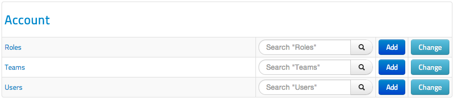
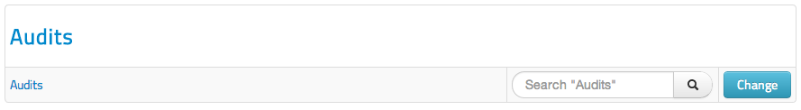
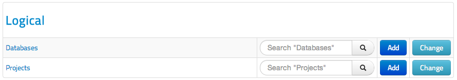
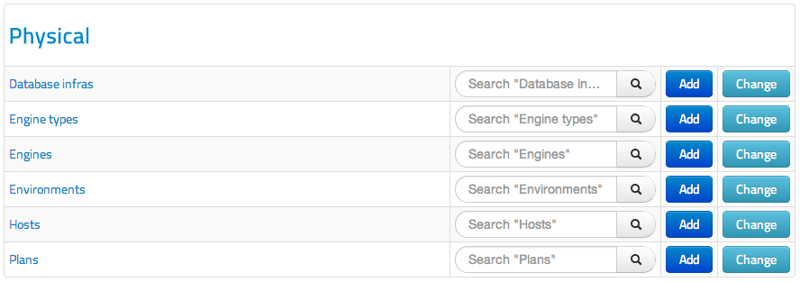
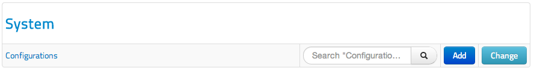
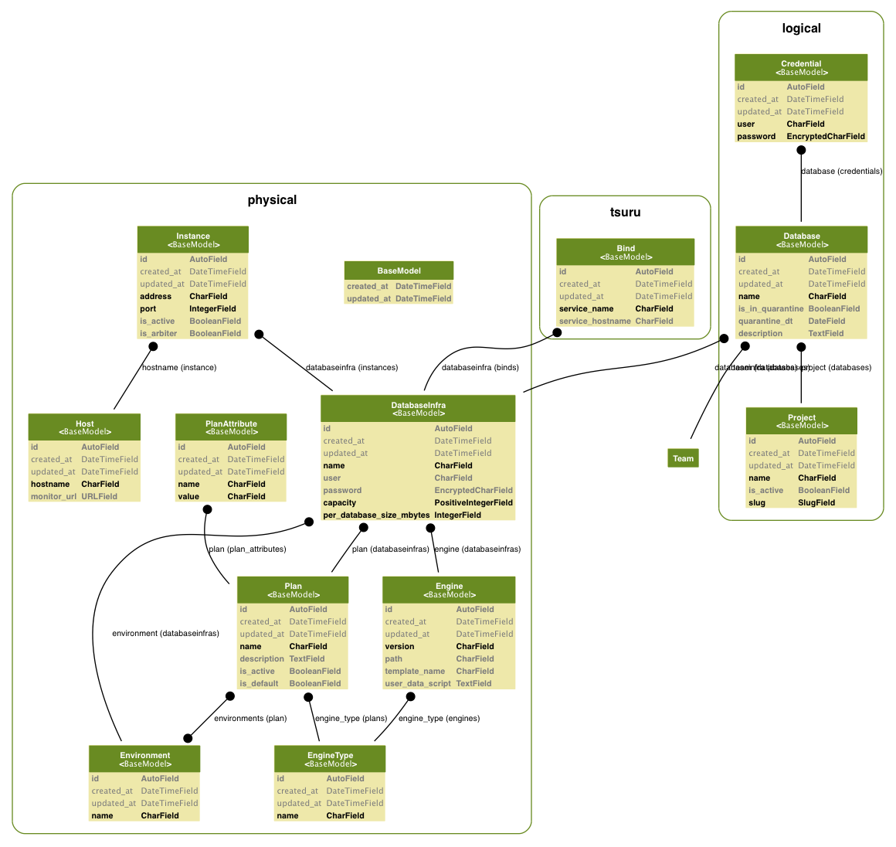

# Definitions

This guide will help you to understand the basic DBaaS architecture.

Basically DBaaS has 2 kind of users (if you run the `reset_data` command):

* Regular user: Can manage projects, databases and credentials.
* DBA user: Regular user roles +  physical and logical structure.

## 1. Account APP

### 1.1 Roles
You can create one or more roles you want assign appropriate permissions. We are using 2 kinds of roles: regular and DBA user.

### 1.2 Teams
It's sort of a proxy for roles. The team has only one role, but one or more users. Subsequently those users inherit the team role.

### 1.3 Users
Users in the system. The user must have a team for usage.

## 2. Audit APP

View the main actions that the users have done on DBaaS

## 3. Logical APP

### 3.1 Databases
Manage the databases and their credentials

### 3.2 Projects
It's possible to organize your databases logically by project.

## 4. Physical APP

### 4.1 Database Infras
It's a group of host(s) will be used for the same purpose, like a cluster/replica set.
More details about each field:

* databaseinfra name: whatever you want to call
* databaseinfra user/password: it's your admin user in mongodb or root in mysql
* engine/plan/environment: self description fields :)
* capacity: how many databases the currently databaseinfra can hold.
* max database size: it's an account about capacity and how big the database can be
* Instances: all siblings servers

### 4.2 Engine Types
In other words, the drivers DBaaS supports

### 4.3 Engines
It is a composite key: engine type + db version.
eg: mongodb + 2.4.5

### 4.4 Environments
Projects usually have at least two environments: development and production.
This information will be used to associate the databaseinfra and plans.

### 4.5 Hosts
The host where the database instance will run (eg: mongodb or mysql daemon). Of course you can run more than one instance in each host.

### 4.6 Plans
Currently is merely informative, DBaaS doesn't support quota for databases yet.
You have to provide at least one plan (eg: small, medium) per engine type and
choose which environment this plan can be used. A plan is a n-to-n relationship with environment.

## 5. System APP

You can input/change some system parameters dynamically, it's a key/value parameter. The value will be cached in the cache middleware defined in the settings.py file until it is updated. Bellow the parameters already supported by DBaaS:

* `email_addr_from`: (__mandatory__)

    The entity who sends the e-mail to `new_user_notify_email`

* `new_user_notify_email`: (__mandatory__)

    Destination address for DBaaS notifications, like a new user, etc

* `quarantine_retention_days`: (__default: 7__)

    How long the database in quarantine will be hold until purge it. The parameter is informative, not implemented yet.

* `mongo_connect_timeout`: (__default: 5__)

    how long (in seconds) a connection can take to be opened before timing out.

* `mysql_connect_timeout`: (__default: 5__)

    how long (in seconds) a connection can take to be opened before timing out.

# Model

