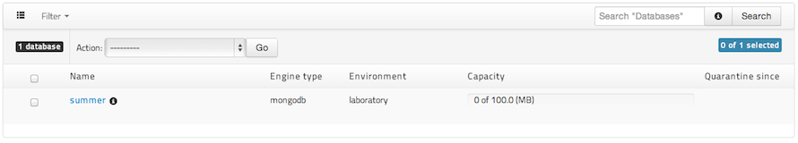
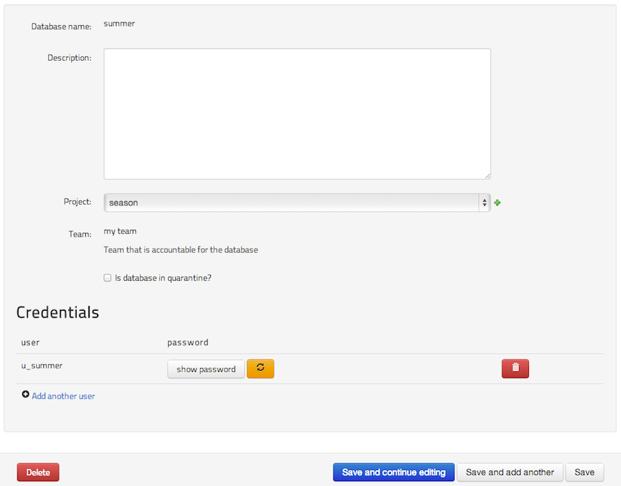

## A Step by step guide to make your DBaaS running :)

Have you already read [readme](../README.md) and [definitions](./DEFINITIONS.md)?
Not yet? Please do that before go ahead.

...

What you have:

* a server: `my_server` => `192.168.1.100`
  * harddrive: 500M (exclusive for database)
  * RAM: 512MB 
* mongodb: version >2.4.5 listening on port 27017
* mongodb admin user: admin / 123456
* environment: laboratory

The instructions bellow are in the execution order.

## Creating the basic infrastructure

Sign in as DBA user:

### 1. Physical APP:
### 1.1 Hosts:
* hostname: `my_server`

### 1.2 Environments
* environment: `laboratory`

### 1.3 Engine types
* engine type: `mongodb`

### 1.4 Engine
* Engine types: Choose `mongodb`
* Engine version `2.4.5`
* leave blank the other fields

### 1.5 Plans
* plan name: `small`
* is plan default: `check the box`
* engine type: choose `mongodb`
* environments: move `laboratory` to the right
* leave blank all other fields

### 1.6 Database infras
* DatabaseInfra name: `small_single_instance_infra`
* DatabaseInfra user: `admin`
* DatabaseInfra password: `123456`
* Engine: `mongodb_2.4.5`
* Plan: `Plan small`
* Environment: `laboratory`
* Capacity: `5`
* Max database size(MB): `100`
* Instances:
  * Hostname: choose `my_server`
  * Instance address: `192.168.1.100`
  * Instance port: `27017`

## Creating a database

Sign in as DBA user or create a regular user to login:

### 2. Logical APP:
### 2.1 Projects
* Project name: `season`

### 2.2 Databases
* Database name: `summer`
* Project: `season`
* Engine: choose `mongodb_2.4.5`
* Environment: `laboratory`
so then, choose `Plan small`

### The result is: a database named as `summer` and a default credential: `u_summer`.

figure 1: listing databases:

figure 2: Summer DB details

